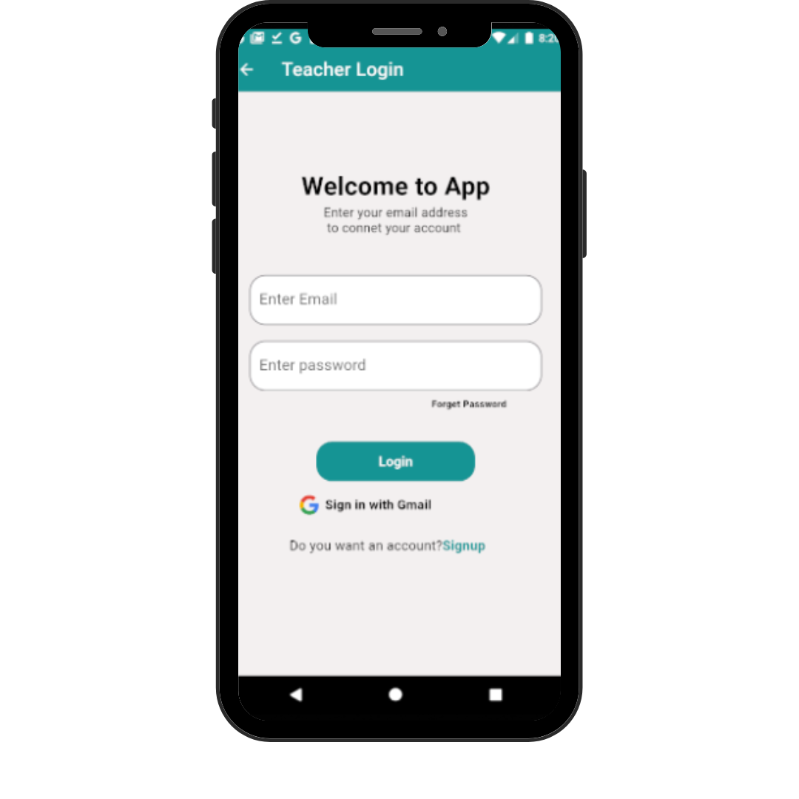
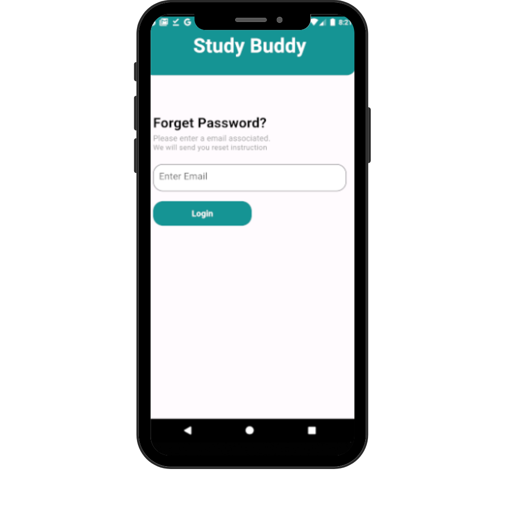
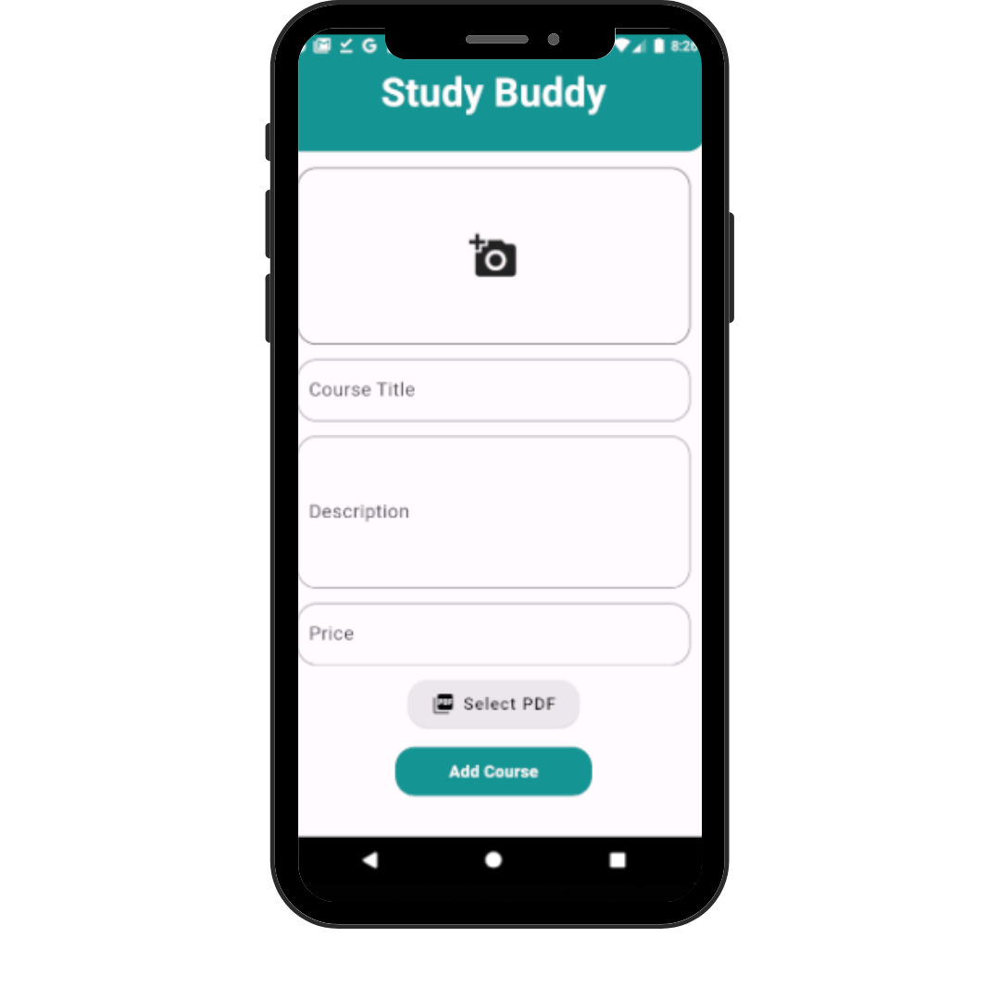

# 📚 StuddyBuddy – FYP Flutter App

StuddyBuddy is a comprehensive learning platform built for both **students** and **tutors**.  
It offers a complete course browsing, enrollment, and management system — with **separate dashboards** for students and teachers.

This app is built using **Flutter**, integrated with **Firebase**, and includes support for **Stripe payments**.

---

## 📸 App Screenshots

Here are some screenshots showcasing the app features:

### 🔹 Student Dashboard

| Home Page | Course Detail | Enrolled Courses |
|-----------|---------------|------------------|
|  |  |  |

### 🔹 Course Marketplace & Search

| Browse Courses | Search | Filter |
|----------------|--------|--------|
|  |  |  |

### 🔹 Tutor Dashboard & Management

| Tutor Home | Add Course | Earnings |
|------------|------------|----------|
|  |  |  |

### 🔹 Payment Integration

| Stripe Checkout |
|-----------------|
|  |

---

## 🧠 Key Features

- 🔐 Firebase Authentication (Login/Signup)
- 🎓 Separate dashboards for students and tutors
- 💳 Stripe payment integration
- 🔎 Course search & filters
- 🧾 Admin panel support
- 💬 Course reviews and chat module

---

> 📁 All screenshots are located in: `fyp/ScreenShots/`
